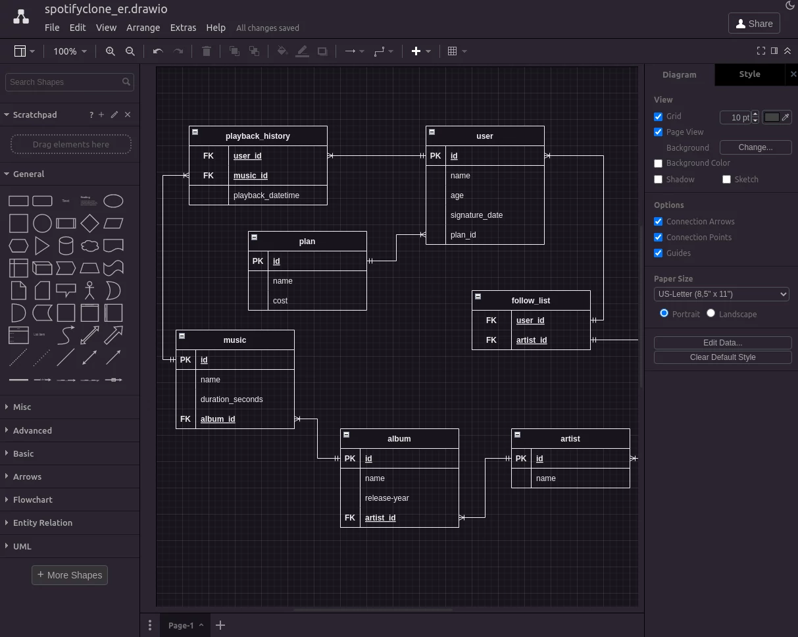
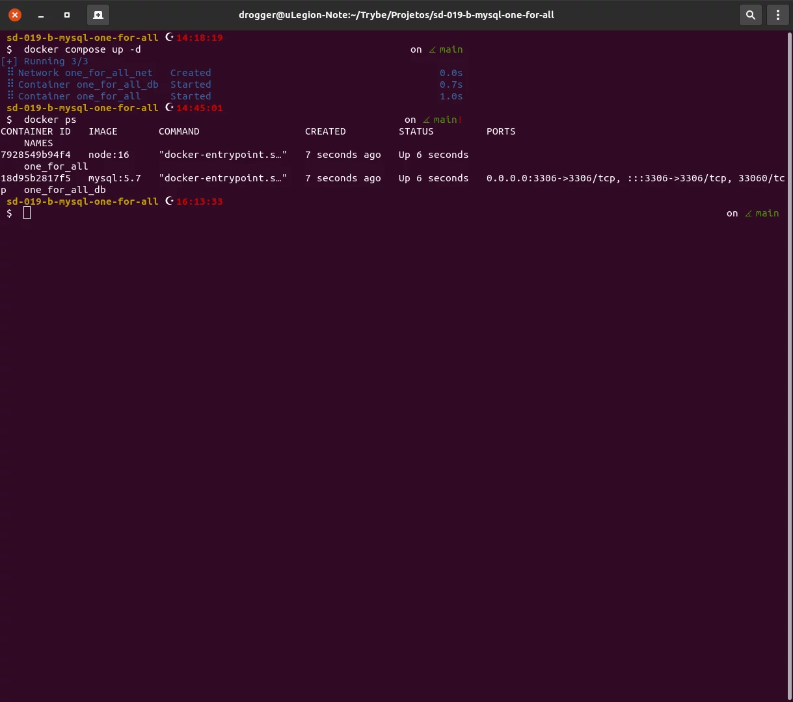

# Sobre

## Seção: `Funções SQL, JOINs e Normalização`

- Tivemos uma introdução a modelagem de banco de dados, transformando ideias em modelo de banco de dados, identificando entidades, atributos e relacionamentos, construindo diagramas de entidade relacional(ER) e a normalizar o banco de dados seguindo as Formas Normais, 1ª, 2ª e 3ª forma normal.
- Essa seção aprofundamos os conhecimentos usando condicionais, manipular strings, criar funções matemáticas com o MYSQL, extração de informações específicas sobre datas, utilizar funções de agregação AVG, MIN, MAX SUM e COUNT, criar agrupamento usando GROUP BY e HAVING.
- Combinar dados de duas ou mais tabelas com INNER JOIN, LEFT JOIN, RIGHT JOIN e SELF JOIN.

#

  

>*Conteúdo sobre comandos usados para o buscas no mysql*
#
## Projeto: `One For All`

- lore

# Tecnologias e ferramentas usadas 🛠

# Desafios

- lore

# Conclusão

- lore

  

    <strong>
      :newspaper_roll: Requisitos solicitados durante o desenvolvimento do projeto
    </strong>
  

 
### Requisitos
*Nome* | *Avaliação*
--- | :---:
1 - lore | :heavy_check_mark:

  

    <strong>
      :memo: Todo list
    </strong>
  

  - [x] - ~~Criar aplicação com base nos requisitos da trybe.~~ 

#

  

