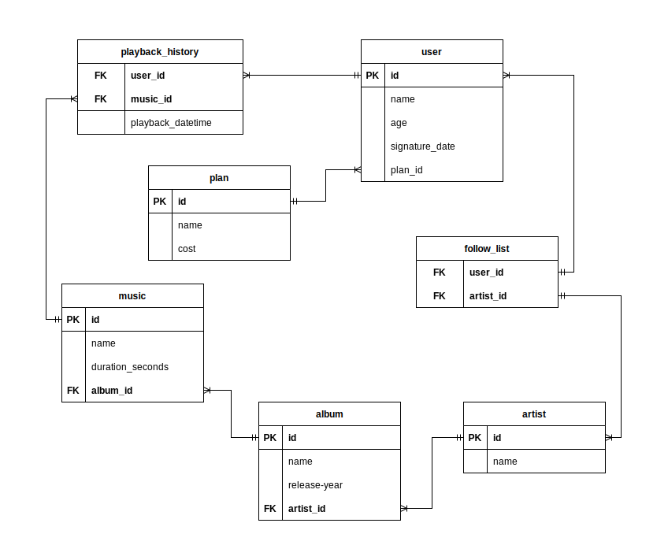

# Sobre

## Seção: `Funções SQL, JOINs e Normalização`

- Tivemos uma introdução a modelagem de banco de dados, transformando ideias em modelo de banco de dados, identificando entidades, atributos e relacionamentos, construindo diagramas de entidade relacional(ER) e a normalizar o banco de dados seguindo as Formas Normais, 1ª, 2ª e 3ª forma normal.
- Essa seção aprofundamos os conhecimentos usando condicionais, manipular strings, criar funções matemáticas com o MYSQL, extração de informações específicas sobre datas, utilizar funções de agregação AVG, MIN, MAX SUM e COUNT, criar agrupamento usando GROUP BY e HAVING.
- Combinar dados de duas ou mais tabelas com INNER JOIN, LEFT JOIN, RIGHT JOIN e SELF JOIN.

#

  

>*Conteúdo sobre comandos usados para o buscas no mysql*
#
## Projeto: `One For All`

- Criar um banco de dados relacionado seguindo a até 3ª normalização de um Clone do Spotify, onde possuimos usuários, artistas, albuns, musicas, histórico de músicas tocas e lista de seguidores.

# Tecnologias e ferramentas usadas 🛠

# Desafios

- Diferente do anterior, esse projeto teve todo um desenvolvimento e planejamento na criação da tabela, definindo a relação entre as tabelas, um para muitos(1:N), muitos para muitos(N:N) e normalização do banco, para construir um banco efieciente.
- Usei uma ferramenta para desenhar o relacionamento indicado pela trybe no curso, [draw.io](https://draw.io/).
- Comecei analisando quais tabelas preciso criar, começando, user, plan, playback_history, music, album e artist.
- Iniciando pela tabela de usuário e todos seus relacionametos, ele pode ter apenas um plano, e um plano pode ter vários usuários, tornando (plan)1:N(user).
- Como um usuário pode seguir vários artistas e um artista pode ser seguido por vários usuários, sendo uma relação N:N, foi necessária a criação de uma tabela follow_list, para representar o relacionamento das tabelas que tem multiplos relacionamentos, criando uma chave primária composta com os ids de artista e user, tornando possivel, um usuário seguir vários artista e vários artista serem seguidos por vários usuários.
- Histórico de musicas, pode ter apenas um usuário e uma música, mas o usuário e a musica podem ter vários históricos de muśica, (playback_history)1:N(user) e (playback_history)1:N(music).
- Tabela de Musica, uma música pode pertencer para 1 album, e um album pode ter várias músicas (music)1:N(album).
- Um album pertence há um artista e um artista pode ter vários albuns. (album)1:N(artista).

>Formando o seguinte Diagrama ER:

- Seguindo do uso de JOINs, abstrair e analisar qual a melhor forma e usar join, foi bem desafiador!

# Conclusão

- Nesse projeto tive que usar bem mais a criatividade e habilidades analiticas, criando e desenhando todo um modelo, seguindo de união de tabelas para formar informações concatenadas com seu relacionamento.

  

    <strong>
      :newspaper_roll: Requisitos solicitados durante o desenvolvimento do projeto
    </strong>
  

 
### Requisitos
*Nome* | *Avaliação*
--- | :---:
1 - lore | :heavy_check_mark:

  

    <strong>
      :memo: Todo list
    </strong>
  

  - [x] - ~~Criar aplicação com base nos requisitos da trybe.~~ 

#

  

